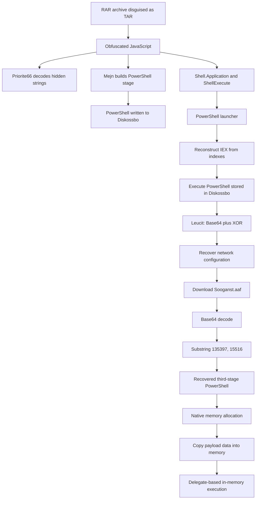

# Deobfuscating a Multi-Stage JavaScript and PowerShell Loader

## Scope

This write-up focuses on the obfuscation and execution chain used by a malicious JavaScript loader. The objective was to recover embedded PowerShell stages, explain the decoding mechanisms, and document the transition from script-based execution to in-memory loading.

This is **not** a complete reverse engineering analysis of the final payload. The final malware family and its full capabilities are outside the scope of this document.

---

## 1. RAR archive disguised as TAR

The first analyzed artifact used a misleading file extension:

```text
RPF1910485_20260727.tar
```

Despite the `.tar` extension, file-type identification showed that the artifact was actually a **RAR5 archive**.

```bash
file RPF1910485_20260727.tar
```

Example result:

```text
RAR archive data, v5
```

This is a simple but effective evasion technique. File extensions are not reliable indicators of the actual format, so potentially malicious attachments should always be identified by their file signature or magic bytes.


After extraction, the archive contained an obfuscated JavaScript file intended for execution through Windows Script Host.

### JavaScript sample

```text
File type: JavaScript / Windows Script Host
SHA-256: 30bf0e7a64d4d0a03713ea1a5c5045dc21a6a23f4a958105e922617e982fa9eb
```

---

## 2. Initial JavaScript triage

The JavaScript was heavily obfuscated and contained:

- very long lines;
- large amounts of irrelevant or dead code;
- random variable and function names;
- fragmented strings;
- dynamically constructed PowerShell code;
- Windows COM objects used for file and process operations.

Formatting the script made its control flow easier to inspect, but did not remove the actual obfuscation.

During the initial triage, the most relevant keywords were:

```text
ActiveXObject
CreateTextFile
ShellExecute
WScript
PowerShell
eval
```

The sample instantiated several COM objects:

```javascript
new ActiveXObject("WScript.Shell");
new ActiveXObject("Scripting.FileSystemObject");
new ActiveXObject("Shell.Application");
```

Their roles were:

| COM object | Purpose |
|---|---|
| `WScript.Shell` | Environment expansion and command execution |
| `Scripting.FileSystemObject` | File creation, writing and reading |
| `Shell.Application` | Process execution through `ShellExecute()` |


---

## 3. Character-based string obfuscation

One of the most important JavaScript deobfuscation routines was:

```javascript
function Priorite66(text) {
    var result = "";

    for (var i = 3; i < text.length; i += 4) {
        result += text.charAt(i);
    }

    return result;
}
```

The function extracts characters at the following indexes:

```text
3, 7, 11, 15, 19, ...
```

In other words, it takes every fourth character, starting at index `3`.

A simplified example:

```text
xxxPyyyOzzzWaaaEbbbR
   ^   ^   ^   ^   ^
   3   7  11  15  19
```

The decoded result is:

```text
POWER
```

The malware used this technique to hide strings associated with execution, including fragments that reconstructed values such as:

```text
explorer
open
power
hell.exe
```

This avoided storing some high-signal strings directly in the JavaScript source.


For readability, the function can be understood as:

```javascript
decodeEveryFourthCharacter(text)
```

---

## 4. PowerShell assembled inside the `Mejn` variable

The JavaScript did not contain the next PowerShell stage as one continuous block. Instead, it constructed the script at runtime:

```javascript
Mejn = "first PowerShell fragment...";
Mejn += "next fragment...";
Mejn += "another fragment...";
```

The important observation was that `Mejn` was not a regular configuration value. It contained the complete PowerShell stage assembled from multiple string fragments.

A more descriptive name would be:

```text
Mejn → stage2PowerShell
```


This technique makes static inspection harder because the complete script must first be reconstructed from all assignments to the variable.

---

## 5. Dropping the PowerShell stage to disk

The content stored in `Mejn` was passed to a function named `Dkskosta()`.

The function performed file creation and writing through `Scripting.FileSystemObject`:

```javascript
function Dkskosta(path, content) {
    var file = fileSystemObject.CreateTextFile(path, true, false);
    file.Write(content);
}
```

In the original sample, the call was equivalent to:

```javascript
Dkskosta(stage2Path, Mejn);
```

The destination path resolved to:

```text
%LOCALAPPDATA%\Diskossbo
```

Therefore, the JavaScript execution flow was:

```text
Mejn
  ↓
complete PowerShell text
  ↓
CreateTextFile()
  ↓
%LOCALAPPDATA%\Diskossbo
```

Suggested descriptive names:

| Original name | Interpreted role |
|---|---|
| `Dkskosta` | `writeTextFile` |
| `Mejn` | `stage2PowerShell` |
| `kkengrej` | `stage2Path` |


---

## 6. Execution through `Shell.Application`

The script created a COM object:

```javascript
var Huffishba188 = new ActiveXObject("Shell.Application");
```

The variable itself did not execute anything. It stored a reference to the `Shell.Application` COM object.

Execution occurred when the sample called:

```javascript
Huffishba188.ShellExecute(...);
```

A descriptive interpretation is:

```text
Huffishba188 → shellApplication
```

The sample used `ShellExecute()` to introduce an additional execution layer involving Explorer before starting PowerShell.

The observed execution flow was approximately:

```text
wscript.exe
    ↓
JavaScript
    ↓
Shell.Application.ShellExecute()
    ↓
explorer.exe
    ↓
powershell.exe
```

This is more indirect than a simple:

```text
wscript.exe → powershell.exe
```

and can complicate basic parent-child process detections.


---

## 7. Reconstructing `IEX` from the dropped script

The JavaScript launched a short PowerShell command that read the previously dropped `Diskossbo` file.

The command then extracted three characters from specific positions:

```powershell
$code = Get-Content "$HOME\AppData\Local\Diskossbo"

$command =
    $code[3897] +
    $code[3898] +
    $code[3899]
```

The characters at those positions formed:

```text
iEX
```

`IEX` is the PowerShell alias for:

```text
Invoke-Expression
```

The resulting behavior was equivalent to:

```powershell
IEX $code
```

This means the short launcher:

1. read the PowerShell stored in `Diskossbo`;
2. reconstructed the command name `IEX` from the script content itself;
3. executed the complete recovered stage.

The technique hides the direct use of `IEX` in the launcher command line.


---

## 8. Base64 and repeating-key XOR obfuscation

The PowerShell recovered from `Mejn` contained another decoding function named `Leucit`.

Its logic was equivalent to:

```text
Base64 decoding
    ↓
XOR with a repeating key
    ↓
byte-to-text conversion
    ↓
optional execution of the decoded result
```

The XOR key was stored as decimal character codes:

```powershell
@(77, 101, 110, 105, 103, 104, 101, 100)
```

Converted to ASCII, the values produced:

```text
Menighed
```

The key was repeated across the decoded byte sequence:

```text
MenighedMenighedMenighed...
```

Some calls to `Leucit` returned a decoded value:

```powershell
$variable = Leucit '<encoded data>'
```

Other calls used an additional argument:

```powershell
Leucit '<encoded data>' 1
```

In those cases, the recovered PowerShell was intended to be executed.

Static deobfuscation revealed strings associated with network communication:

```text
hxxps://homeyhouse[.]cl/Sooganst[.]aaf
Msxml2.ServerXMLHTTP.6.0
GET
User-Agent
```


---

## 9. Retrieval of the next stage

The recovered PowerShell created a COM-based HTTP client:

```text
Msxml2.ServerXMLHTTP.6.0
```

It then performed a synchronous HTTP `GET` request to:

```text
hxxps://homeyhouse[.]cl/Sooganst[.]aaf
```

The response was written to:

```text
%APPDATA%\Henhol.Tro
```

The simplified behavior was:

```text
Create HTTP COM object
    ↓
Open synchronous GET request
    ↓
Set User-Agent
    ↓
Send request
    ↓
Check for HTTP 200
    ↓
Write response bytes to disk
```

The downloaded object was not handled as a directly executable PE file. It was treated as a textual container containing another encoded stage.

---

## 10. Hiding PowerShell inside a padded Base64 container

The downloaded `Sooganst.aaf` file was identified as ASCII text with a long Base64-like sequence.

Its SHA-256 was:

```text
b8252331808db69cb7fa4b56fd5f85acc0448bd8980cbaa641113ec979a92296
```

The PowerShell performed the following operations:

```powershell
[Convert]::FromBase64String(...)
[Text.Encoding]::ASCII.GetString(...)
.Substring(135397, 15516)
```

This means that the malware:

1. decoded the complete file from Base64;
2. converted the result to ASCII text;
3. ignored most of the decoded content;
4. extracted exactly `15,516` characters beginning at index `135,397`;
5. executed the extracted text as another PowerShell stage.

The relevant extraction can be represented as:

```text
decoded content
    ↓
start index: 135397
length:      15516
    ↓
next PowerShell stage
```

The remaining content acted as padding or decoy data around the actual stage.


---

## 11. Indicators of in-memory loading

The recovered third-stage PowerShell contained strings and operations associated with memory-based loading:

```text
VirtualAlloc
NtProtectVirtualMemory
Marshal.Copy
GetDelegateForFunctionPointer
```

The script dynamically resolved native functions and created .NET delegates for their invocation.

Two memory regions were allocated. The first `8,848` bytes of a byte array named `$Caravan` were copied into one region, while the remaining data was copied into another region.

The observed flow was:

```text
$Caravan byte array
    ├── first 8,848 bytes → first memory region
    └── remaining bytes   → second memory region
```

The script then converted native memory addresses into callable delegates through:

```text
GetDelegateForFunctionPointer
```

This behavior is consistent with an in-memory loader that prepares and executes code without writing a conventional executable payload to disk.


Static analysis confirmed the presence of in-memory allocation and execution primitives. Fully reconstructing the final payload and the complete injection path was outside the scope of this analysis.

---

## 12. Deobfuscation summary

The sample used several distinct obfuscation and execution techniques:

| Technique | Purpose |
|---|---|
| RAR archive disguised as TAR | Mislead file-type inspection |
| Large amounts of dead or irrelevant code | Increase analysis time |
| Random function and variable names | Reduce readability |
| Every-fourth-character extraction | Hide sensitive strings |
| Fragmented PowerShell in `Mejn` | Conceal the complete second stage |
| Dynamic `IEX` reconstruction | Avoid direct command-name exposure |
| Base64 plus repeating-key XOR | Protect commands, strings and configuration |
| Padded Base64 container | Hide the next stage inside a larger blob |
| Runtime substring extraction | Recover only the embedded PowerShell region |
| Dynamic native function resolution | Avoid straightforward API declarations |
| Memory allocation and delegate execution | Execute the next component in memory |

---

## 13. Execution-chain overview



---

## 14. Indicators

| Type | Value |
|---|---|
| JavaScript SHA-256 | `30bf0e7a64d4d0a03713ea1a5c5045dc21a6a23f4a958105e922617e982fa9eb` |
| Downloaded container SHA-256 | `b8252331808db69cb7fa4b56fd5f85acc0448bd8980cbaa641113ec979a92296` |
| Domain | `homeyhouse[.]cl` |
| URL | `hxxps://homeyhouse[.]cl/Sooganst[.]aaf` |
| Dropped PowerShell path | `%LOCALAPPDATA%\Diskossbo` |
| Downloaded-stage path | `%APPDATA%\Henhol.Tro` |
| JavaScript runtime | `wscript.exe` |
| Execution object | `Shell.Application` |
| HTTP COM object | `Msxml2.ServerXMLHTTP.6.0` |
| XOR key | `Menighed` |

Indicators should be validated against the environment and should not be treated as permanent detections without additional context.

---

## 15. Conclusion

This analysis focused on the obfuscation and execution chain rather than on fully reverse engineering the final malware payload.

The JavaScript loader used multiple layers to hide its behavior:

1. a RAR archive presented with a TAR extension;
2. character-position-based JavaScript string decoding;
3. runtime construction and dropping of a PowerShell stage;
4. indirect process execution through `Shell.Application`;
5. reconstruction of `IEX` from selected character positions;
6. Base64 and repeating-key XOR obfuscation;
7. extraction of PowerShell from a padded data container;
8. dynamic resolution of native functions and in-memory loading.

The case demonstrates why sandbox telemetry and targeted static deobfuscation complement each other. Automated analysis can expose processes and runtime behavior, while manual inspection can reveal hidden configuration, decoding routines and the exact transitions between individual stages.

The purpose of this write-up was to document those transitions without claiming a complete analysis of the final payload.

## Disclaimer

This publication was prepared for educational, research, and professional-development purposes. It presents technical observations, methods, and conclusions based on materials available at the time of analysis.

It does not contain personal data, credentials, private communications, internal telemetry, confidential or proprietary information, or organization-specific infrastructure details. Any sensitive contextual details have been omitted or anonymized. Public technical indicators are included only where relevant and are defanged when appropriate.

Unless explicitly stated otherwise, this publication does not identify the source, owner, affected entity, or circumstances in which the analyzed material was obtained or observed. The findings reflect the available evidence and the scope defined for the analysis.
