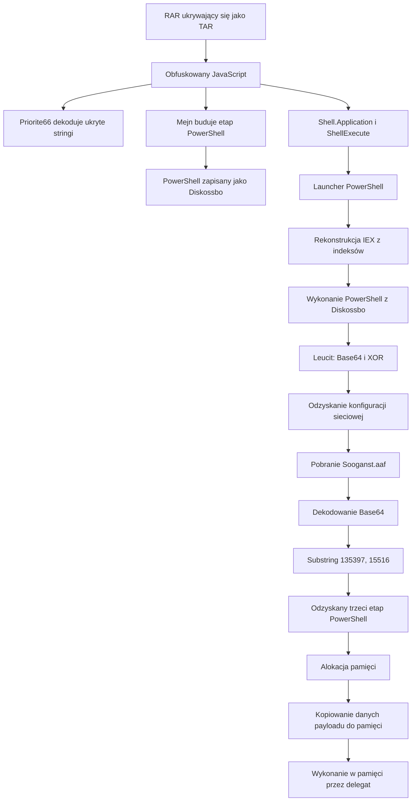

# Deobfuskacja wieloetapowego loadera JavaScript i PowerShell

## Zakres analizy

Niniejszy materiał koncentruje się na łańcuchu obfuskacji i wykonania zastosowanym przez złośliwy loader JavaScript. Celem analizy było odzyskanie osadzonych etapów PowerShell, wyjaśnienie mechanizmów dekodowania oraz udokumentowanie przejścia od wykonania skryptowego do ładowania kodu w pamięci.

VirusTotal klasyfikuje analizowaną próbkę jako **GuLoader**. Klasyfikacja ta została potraktowana jako zewnętrzna etykieta, a nie jako niezależnie potwierdzona atrybucja rodziny malware.

Nie jest to kompletna analiza reverse engineering końcowego payloadu. Pełna funkcjonalność ostatniego etapu oraz ostateczne przypisanie rodziny pozostają poza zakresem materiału.

Repozytorium nie zawiera aktywnych próbek malware.

---

## 1. Archiwum RAR ukrywające się pod rozszerzeniem TAR

Pierwszy analizowany artefakt wykorzystywał mylące rozszerzenie:

```text
RPF1910485_20260727.tar
```

Pomimo rozszerzenia `.tar` identyfikacja typu pliku wykazała, że artefakt był w rzeczywistości archiwum **RAR5**.

```bash
file RPF1910485_20260727.tar
```

Przykładowy wynik:

```text
RAR archive data, v5
```

Jest to prosta technika utrudniająca wstępną identyfikację załącznika. Rozszerzenie pliku nie powinno być traktowane jako wiarygodne źródło informacji o jego formacie. Podejrzane pliki należy identyfikować na podstawie sygnatury, magic bytes lub wyników narzędzi takich jak `file`.

Po rozpakowaniu archiwum odzyskano obfuskowany plik JavaScript przeznaczony do uruchomienia przez Windows Script Host.

### Próbka JavaScript

```text
Typ pliku: JavaScript / Windows Script Host
SHA-256: 30bf0e7a64d4d0a03713ea1a5c5045dc21a6a23f4a958105e922617e982fa9eb
Klasyfikacja VirusTotal: GuLoader
```

---

## 2. Wstępny triage JavaScriptu

Kod JavaScript był silnie obfuskowany i zawierał:

- bardzo długie linie;
- dużą ilość nieistotnego lub martwego kodu;
- losowe nazwy funkcji i zmiennych;
- podzielone stringi;
- kod PowerShell budowany dynamicznie;
- obiekty COM wykorzystywane do operacji na plikach i uruchamiania procesów.

Sformatowanie kodu ułatwiło analizę przepływu, ale samo w sobie nie usunęło obfuskacji.

Podczas wstępnego triage'u szczególnie istotne były ciągi:

```text
ActiveXObject
CreateTextFile
ShellExecute
WScript
PowerShell
eval
```

Próbka tworzyła kilka obiektów COM:

```javascript
new ActiveXObject("WScript.Shell");
new ActiveXObject("Scripting.FileSystemObject");
new ActiveXObject("Shell.Application");
```

Ich role można podsumować następująco:

| Obiekt COM | Rola |
|---|---|
| `WScript.Shell` | Rozwijanie zmiennych środowiskowych i wykonywanie poleceń |
| `Scripting.FileSystemObject` | Tworzenie, zapisywanie i odczytywanie plików |
| `Shell.Application` | Uruchamianie procesów przez `ShellExecute()` |

---

## 3. Obfuskacja stringów przez wybieranie znaków

Jedną z najważniejszych funkcji dekodujących w JavaScript była:

```javascript
function Priorite66(text) {
    var result = "";

    for (var i = 3; i < text.length; i += 4) {
        result += text.charAt(i);
    }

    return result;
}
```

Funkcja pobiera znaki o indeksach:

```text
3, 7, 11, 15, 19, ...
```

Oznacza to, że wybiera co czwarty znak, rozpoczynając od indeksu `3`.

Uproszczony przykład:

```text
xxxPyyyOzzzWaaaEbbbR
   ^   ^   ^   ^   ^
   3   7  11  15  19
```

Wynik:

```text
POWER
```

W analizowanej próbce technika ta ukrywała fragmenty stringów związanych z wykonaniem kodu, między innymi:

```text
explorer
open
power
hell.exe
```

Pozwalało to uniknąć przechowywania niektórych charakterystycznych ciągów bezpośrednio w kodzie źródłowym.

Dla czytelności funkcję `Priorite66()` można interpretować jako:

```javascript
decodeEveryFourthCharacter(text)
```

---

## 4. PowerShell składany w zmiennej `Mejn`

Kolejny etap PowerShell nie występował w kodzie JavaScript jako jeden ciągły blok. Był budowany dynamicznie z wielu fragmentów:

```javascript
Mejn = "pierwszy fragment PowerShell...";
Mejn += "kolejny fragment...";
Mejn += "następny fragment...";
```

Najważniejszym wnioskiem było ustalenie, że `Mejn` nie jest zwykłą zmienną konfiguracyjną. Przechowuje kompletny skrypt PowerShell złożony z wielu stringów.

Bardziej opisowa nazwa:

```text
Mejn → stage2PowerShell
```

Technika utrudnia analizę statyczną, ponieważ pełna zawartość etapu musi zostać zrekonstruowana ze wszystkich przypisań do zmiennej.

---

## 5. Zapis etapu PowerShell na dysku

Zawartość zmiennej `Mejn` była przekazywana do funkcji `Dkskosta()`.

Funkcja korzystała z `Scripting.FileSystemObject` do utworzenia pliku i zapisania danych:

```javascript
function Dkskosta(path, content) {
    var file = fileSystemObject.CreateTextFile(path, true, false);
    file.Write(content);
}
```

Wywołanie w próbce odpowiadało logicznie:

```javascript
Dkskosta(stage2Path, Mejn);
```

Ścieżka docelowa rozwijała się do:

```text
%LOCALAPPDATA%\Diskossbo
```

Przepływ danych wyglądał następująco:

```text
Mejn
  ↓
kompletny kod PowerShell
  ↓
CreateTextFile()
  ↓
%LOCALAPPDATA%\Diskossbo
```

Proponowane nazwy opisowe:

| Nazwa oryginalna | Zidentyfikowana rola |
|---|---|
| `Dkskosta` | `writeTextFile` |
| `Mejn` | `stage2PowerShell` |
| `kkengrej` | `stage2Path` |

---

## 6. Wykonanie przez `Shell.Application`

Skrypt tworzył obiekt COM:

```javascript
var Huffishba188 = new ActiveXObject("Shell.Application");
```

Samo przypisanie nie uruchamiało procesu. Zmienna `Huffishba188` przechowywała referencję do obiektu `Shell.Application`.

Wykonanie następowało po wywołaniu:

```javascript
Huffishba188.ShellExecute(...);
```

Opisowa interpretacja:

```text
Huffishba188 → shellApplication
```

Próbka używała `ShellExecute()` do wprowadzenia dodatkowej warstwy wykonania związanej z procesem Explorer przed uruchomieniem PowerShella.

Przybliżony łańcuch:

```text
wscript.exe
    ↓
JavaScript
    ↓
Shell.Application.ShellExecute()
    ↓
explorer.exe
    ↓
powershell.exe
```

Jest to bardziej pośredni wariant niż prosty łańcuch:

```text
wscript.exe → powershell.exe
```

Może to utrudnić proste reguły detekcyjne oparte wyłącznie na bezpośredniej relacji rodzic–dziecko.

---

## 7. Rekonstrukcja `IEX` z zawartości zapisanego skryptu

JavaScript uruchamiał krótkie polecenie PowerShell, które odczytywało wcześniej zapisany plik `Diskossbo`.

Następnie pobierało trzy znaki z konkretnych pozycji:

```powershell
$code = Get-Content "$HOME\AppData\Local\Diskossbo"

$command =
    $code[3897] +
    $code[3898] +
    $code[3899]
```

Znaki na tych pozycjach tworzyły:

```text
iEX
```

`IEX` jest aliasem PowerShell dla:

```text
Invoke-Expression
```

Końcowe zachowanie odpowiadało:

```powershell
IEX $code
```

Krótki launcher:

1. odczytywał kod PowerShell zapisany w `Diskossbo`;
2. rekonstruował nazwę polecenia `IEX` na podstawie wskazanych znaków;
3. wykonywał kompletny odzyskany etap.

Technika ograniczała bezpośrednią widoczność ciągu `IEX` w linii poleceń launchera.

---

## 8. Obfuskacja Base64 i XOR z powtarzalnym kluczem

PowerShell odzyskany ze zmiennej `Mejn` zawierał funkcję dekodującą o nazwie `Leucit`.

Jej logika odpowiadała następującemu schematowi:

```text
dekodowanie Base64
    ↓
XOR z powtarzalnym kluczem
    ↓
konwersja bajtów do tekstu
    ↓
opcjonalne wykonanie odzyskanego kodu
```

Klucz XOR był zapisany jako dziesiętne kody znaków:

```powershell
@(77, 101, 110, 105, 103, 104, 101, 100)
```

Po konwersji do ASCII otrzymano:

```text
Menighed
```

Klucz był powtarzany wzdłuż dekodowanej sekwencji:

```text
MenighedMenighedMenighed...
```

Niektóre wywołania `Leucit` tylko zwracały odszyfrowaną wartość:

```powershell
$variable = Leucit '<zakodowane dane>'
```

Inne zawierały dodatkowy argument:

```powershell
Leucit '<zakodowane dane>' 1
```

W tym wariancie odzyskany kod miał zostać wykonany.

Statyczna deobfuskacja ujawniła stringi związane z komunikacją sieciową:

```text
hxxps://homeyhouse[.]cl/Sooganst[.]aaf
Msxml2.ServerXMLHTTP.6.0
GET
User-Agent
```

---

## 9. Pobranie kolejnego etapu

Odzyskany PowerShell tworzył klienta HTTP opartego na COM:

```text
Msxml2.ServerXMLHTTP.6.0
```

Następnie wykonywał synchroniczne żądanie `GET` do:

```text
hxxps://homeyhouse[.]cl/Sooganst[.]aaf
```

Odpowiedź była zapisywana jako:

```text
%APPDATA%\Henhol.Tro
```

Uproszczone zachowanie:

```text
utworzenie obiektu HTTP COM
    ↓
otwarcie synchronicznego żądania GET
    ↓
ustawienie User-Agent
    ↓
wysłanie żądania
    ↓
sprawdzenie statusu HTTP 200
    ↓
zapisanie odpowiedzi na dysku
```

Pobrany obiekt nie był traktowany jako bezpośrednio wykonywalny plik PE. Kod obsługiwał go jako tekstowy kontener zawierający kolejny zakodowany etap.

---

## 10. PowerShell ukryty w kontenerze Base64 z paddingiem

Pobrany plik `Sooganst.aaf` został zidentyfikowany jako tekst ASCII zawierający długi ciąg przypominający Base64.

SHA-256:

```text
b8252331808db69cb7fa4b56fd5f85acc0448bd8980cbaa641113ec979a92296
```

PowerShell wykonywał następujące operacje:

```powershell
[Convert]::FromBase64String(...)
[Text.Encoding]::ASCII.GetString(...)
.Substring(135397, 15516)
```

Oznacza to, że malware:

1. dekodował cały plik z Base64;
2. konwertował wynik do tekstu ASCII;
3. pomijał większość zdekodowanej zawartości;
4. wycinał dokładnie `15 516` znaków, rozpoczynając od indeksu `135397`;
5. wykonywał odzyskany tekst jako kolejny etap PowerShell.

Schemat:

```text
zdekodowana zawartość
    ↓
indeks początkowy: 135397
długość:            15516
    ↓
kolejny etap PowerShell
```

Pozostałe dane pełniły rolę paddingu lub zawartości pozorującej.

---

## 11. Wskaźniki ładowania kodu w pamięci

Odzyskany trzeci etap PowerShell zawierał ciągi i operacje związane z ładowaniem kodu do pamięci:

```text
VirtualAlloc
NtProtectVirtualMemory
Marshal.Copy
GetDelegateForFunctionPointer
```

Skrypt dynamicznie rozwiązywał adresy funkcji natywnych i tworzył dla nich delegaty .NET.

Alokowane były dwa obszary pamięci. Pierwsze `8848` bajtów tablicy `$Caravan` kopiowano do pierwszego regionu, natomiast pozostałe dane do drugiego:

```text
tablica bajtów $Caravan
    ├── pierwsze 8848 bajtów → pierwszy obszar pamięci
    └── pozostałe bajty      → drugi obszar pamięci
```

Następnie natywne adresy pamięci były zamieniane na wywoływalne delegaty za pomocą:

```text
GetDelegateForFunctionPointer
```

Zachowanie jest zgodne z loaderem wykonującym kolejny komponent bezpośrednio w pamięci, bez zapisu klasycznego pliku wykonywalnego na dysku.

Analiza statyczna potwierdziła obecność mechanizmów alokacji, kopiowania i wykonywania kodu w pamięci. Pełne odtworzenie końcowego payloadu oraz całego mechanizmu injection pozostało poza zakresem analizy.

---

## 12. Podsumowanie technik obfuskacji

| Technika | Cel |
|---|---|
| Archiwum RAR z rozszerzeniem TAR | Utrudnienie identyfikacji formatu |
| Duża ilość martwego i nieistotnego kodu | Zwiększenie kosztu analizy |
| Losowe nazwy zmiennych i funkcji | Ograniczenie czytelności |
| Wybieranie co czwartego znaku | Ukrycie charakterystycznych stringów |
| PowerShell składany w `Mejn` | Ukrycie kompletnego drugiego etapu |
| Dynamiczna rekonstrukcja `IEX` | Ograniczenie jawnej ekspozycji polecenia |
| Base64 i XOR z powtarzalnym kluczem | Ukrycie poleceń, stringów i konfiguracji |
| Kontener Base64 z paddingiem | Ukrycie kolejnego etapu w większym blobie |
| Wycinanie przez `Substring()` | Odzyskanie właściwego fragmentu PowerShell |
| Dynamiczne rozwiązywanie funkcji natywnych | Unikanie prostych deklaracji API |
| Alokacja pamięci i wykonanie przez delegaty | Uruchomienie kolejnego komponentu w pamięci |

---

## 13. Przegląd łańcucha wykonania



---

## 14. Wskaźniki

| Typ | Wartość |
|---|---|
| SHA-256 JavaScriptu | `30bf0e7a64d4d0a03713ea1a5c5045dc21a6a23f4a958105e922617e982fa9eb` |
| SHA-256 pobranego kontenera | `b8252331808db69cb7fa4b56fd5f85acc0448bd8980cbaa641113ec979a92296` |
| Domena | `homeyhouse[.]cl` |
| URL | `hxxps://homeyhouse[.]cl/Sooganst[.]aaf` |
| Ścieżka zapisanego PowerShella | `%LOCALAPPDATA%\Diskossbo` |
| Ścieżka pobranego etapu | `%APPDATA%\Henhol.Tro` |
| Interpreter JavaScript | `wscript.exe` |
| Obiekt wykonawczy | `Shell.Application` |
| Obiekt HTTP COM | `Msxml2.ServerXMLHTTP.6.0` |
| Klucz XOR | `Menighed` |

Wskaźniki należy zweryfikować w kontekście danego środowiska. Nie powinny być traktowane jako trwałe reguły detekcyjne bez dodatkowego kontekstu.

---

## 15. Wnioski

Analiza koncentrowała się na łańcuchu obfuskacji i wykonania, a nie na pełnym reverse engineeringu końcowego payloadu.

Loader JavaScript wykorzystywał kilka warstw utrudniających analizę:

1. archiwum RAR prezentowane jako plik TAR;
2. dekodowanie stringów na podstawie pozycji znaków;
3. dynamiczne składanie i zapis etapu PowerShell;
4. pośrednie wykonanie przez `Shell.Application`;
5. rekonstrukcję `IEX` z wybranych pozycji;
6. obfuskację Base64 i XOR;
7. wycinanie PowerShella z kontenera zawierającego padding;
8. dynamiczne rozwiązywanie funkcji natywnych i ładowanie kodu w pamięci.

Przypadek pokazuje, że wyniki sandboxów i ukierunkowana analiza statyczna wzajemnie się uzupełniają. Sandbox może ujawnić drzewo procesów i zachowanie runtime, natomiast ręczna analiza pozwala odzyskać ukrytą konfigurację, algorytmy dekodowania oraz dokładne przejścia między etapami.

Celem materiału było udokumentowanie tych mechanizmów bez przedstawiania analizy jako kompletnego reverse engineeringu końcowego payloadu.

## Zastrzeżenie

Niniejsza publikacja została przygotowana w celach edukacyjnych, badawczych oraz rozwoju zawodowego. Przedstawia obserwacje techniczne, zastosowane metody i wnioski oparte na materiałach dostępnych w momencie prowadzenia analizy.

Publikacja nie zawiera danych osobowych, danych uwierzytelniających, prywatnej korespondencji, wewnętrznej telemetrii, informacji poufnych ani zastrzeżonych, a także szczegółów infrastruktury charakterystycznych dla konkretnej organizacji. Wszelkie wrażliwe informacje kontekstowe zostały pominięte lub zanonimizowane. Publiczne wskaźniki techniczne zostały uwzględnione wyłącznie tam, gdzie były istotne dla analizy, oraz odpowiednio zdezaktywowane.

O ile nie wskazano wyraźnie inaczej, publikacja nie identyfikuje źródła, właściciela, podmiotu, którego dotyczy analiza, ani okoliczności, w których analizowany materiał został pozyskany lub zaobserwowany. Przedstawione ustalenia odzwierciedlają dostępne dowody oraz zakres przyjęty dla danej analizy.
